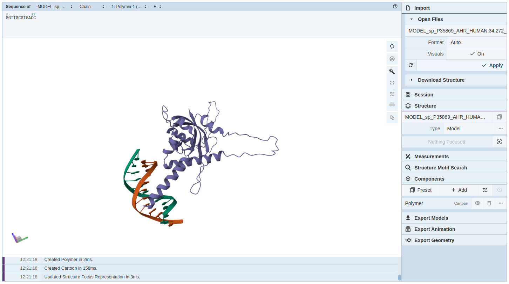
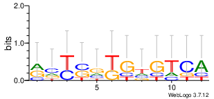
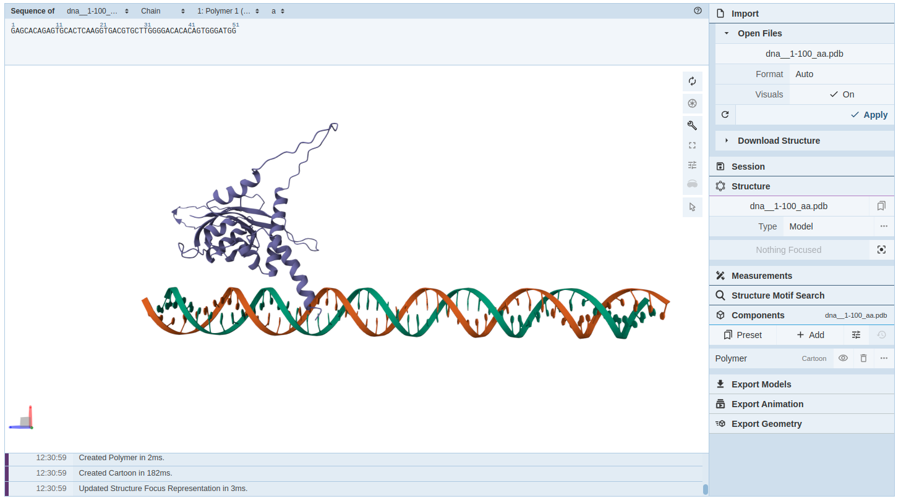
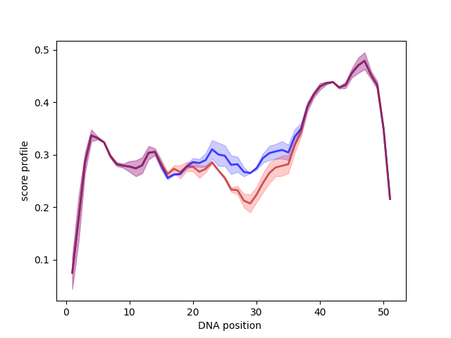

# ModCRElib: ModCRE deployed as a downloadable package

## Table of contents
- [Installation instructions](#installation-instructions)
- [Additional dependency info](#additional-dependency-info)
- [Using ModCRElib](#using-modcrelib)
- [Examples](#examples)
  1. [Modelling a Transcription Factor (TF) from an amino acid sequence](#example-1--modelling-a-transcription-factor-tf-from-an-amino-acid-sequence)
  2. [Predict TF binding specificity](#example-2--predict-tf-binding-specificity)
  3. [Scan a DNA sequence for binding sites](#example-3--scan-dna-sequence-for-binding-sites)
  4. [Generate a model of a TF attached to a predicted binding site along a full-length DNA sequence](#example-4--generate-a-model-of-a-tf-attached-to-a-predicted-binding-site-along-a-full-length-of-dna)
  5. [Generate thread files from a modelled TF](#example-5--generate-thread-files-from-a-modelled-tf)
  6. [Generate a scoring profile of a TF-DNA interaction](#example-6--generate-a-scoring-profile-of-a-tf-dna-interaction)
  7. [Generate a scoring profile plot for a TF along a DNA sequence](#example-7--generate-a-scoring-profile-plot-for-a-tf-along-a-dna-sequence)
  8. [Aggregate PWM clusters for a TF](#example-8--aggregate-pwm-clusters-for-a-tf)
- [Other available functionalities](#other-available-functionalities-that-may-be-of-interest)

---

## Installation instructions

1. Download this repository.
2. Set up a conda environment:
   ```bash
   conda env create -f stable_environment.yml
   conda activate modcrelib_env
   # navigate into the downloaded repository (location of this file)
   ```
   Note that for installs on Apple Silicon machines conda would need to use Intel Emulation to install several of the packages.
3. Download external software:

   **Modeller**
   1. Obtain a Modeller license key for free: https://salilab.org/modeller/registration.html
   2. ```bash
      wget https://salilab.org/modeller/10.3/modeller-10.3.tar.gz
      tar -xvf modeller-10.3.tar.gz
      cd modeller-10.3
      ./Install
      export MODELLER_ROOT='/path/to/install'
      ```

   **X3DNA**
   1. Register for free at http://forum.x3dna.org/index.php
   2. Download 3DNA v2.4.8-2023nov10 from http://forum.x3dna.org/index.php?topic=248.0
   3. Follow the install instructions: http://forum.x3dna.org/howtos/how-to-install-3dna-on-linux-and-windows/

4. Install ModCRElib (install as editable for overview of database installs):
   ```bash
   pip install -e .
   ```
5. Configure ModCRElib (note: some dependencies are large — PBM ≈ 110 GB, PDB ≈ 88 GB):
   ```bash
   modcrelib setup
   ```
6. Check that everything is ready:
   ```bash
   modcrelib doctor
   ```
7. **You're ready to run ModCRElib.**

---

## Installation on osx-arm64 platforms (Apple M1, M2, M3, M4, or later)

You will need to emulate older x64 Intel architecture using Apple's Rosetta 2 

1. Download the repository as before
2. Setup the Conda environment using an intel emulator
   ```bash 
   CONDA_SUBDIR=osx-64 conda env create --file stable_environment.yml
   ```
3. Setup environment to always run on intel
   ```bash
   conda activate modcrelib_env
   conda config --env --set subdir osx-64
   ```
4. Install Modeller through conda (make sure to still supply the licence code following modellers instructions)
   ```bash
   conda install salilab::modeller=10.8 
   ```
5. Run a custom modeller setup script to allow modcrelib to communicate to this modeller install
   ```bash 
   bash setup_modeller.sh 
   ```
6. Run modeller and x3dna export commands as outlined in regular install process
7. Install ModCRElib (install as editable for overview of database installs):
   ```bash
   pip install -e .
   ```
8. Configure ModCRElib (note: some dependencies are large — PBM ≈ 110 GB, PDB ≈ 88 GB):
   ```bash
   modcrelib setup
   ```

---


## Additional dependency info

### Environment dependencies
*(handled by setup — no need to run manually)*

| Tool | Version tested | Link |
|---|---|---|
| BLAST+ | 2.17.0 | https://bio.tools/ncbi_blast_plus |
| CD-HIT | 4.8.1 | https://bio.tools/cd-hit |
| Clustal-Omega | 1.2.4 | https://bio.tools/clustalo |
| ClustalW2 | 2.1 | https://bio.tools/clustalw2_ebi |
| EMBOSS | 6.6.0 | https://bio.tools/emboss |
| Ghostscript | 9.53.3 | https://www.ghostscript.com/ |
| HMMER | 3.3.2 | https://bio.tools/hmmer3 |
| MEME | 5.5.9 | https://bio.tools/meme_suite |
| Python | 3.10.20 | https://www.python.org/ |
| TMalign | 20240303 | https://aideepmed.com/TM-align/ |
| DSSP | 3.1.4 | https://bio.tools/dssp |
| pip | 26.1.2 | https://pip.pypa.io/en/stable/ |

### Python dependencies
*(handled by setup — no need to run manually)*

| Package | Version tested | Notes |
|---|---|---|
| Bio | 1.79 | Biopython (`pip install biopython`) |
| SBILib | 0.3.3 | Bundled with package, or install separately (`pip install SBILib`) — see https://github.com/structuralbioinformatics/SBILib for dependencies |
| bs4 | 4.12.3 | BeautifulSoup (`pip install beautifulsoup4`) |
| bottle | 0.13.4 | Lightweight web framework (`pip install bottle`) |
| ihm | 2.7 | Integrative Modeling library (`pip install ihm`) |
| matplotlib | 3.4.2 | Plotting library (`pip install matplotlib`) |
| numpy | 2.2.6 | Numerical computing (`pip install numpy`) |
| pandas | 2.2.3 | Data analysis (`pip install pandas`) |
| plotly | 5.11.0 | Interactive plotting (`pip install plotly`) |
| scipy | 1.15.3 | Scientific computing (`pip install scipy`) |
| seaborn | 0.11.2 | Statistical plotting (`pip install seaborn`) |
| sklearn | 1.3.2 | scikit-learn (`pip install scikit-learn`) |
| weblogo | 3.9.0 | Sequence logo generation (`pip install weblogo`) |

---

## Using ModCRElib

```
modcrelib <command> [options]
```

| Command | Description |
|---|---|
| `doctor` | Diagnose missing dependencies |
| `setup` | Configure paths, external files, and structural databases |
| `model` | Build protein models |
| `pwm` | Generate PWMs from a TF model |
| `thread` | Generate thread files for a TF-DNA interaction |
| `score` | Calculate the statistical potential score for a TF-DNA interaction |
| `renumber` | Renumber PDB files |
| `profile` | Generate a scoring profile plot for a TF along a DNA sequence |
| `get_json` | Generate input (JSON files) for subsequent PWM aggregation steps |
| `aggregate` | Aggregate PWM clusters for a TF |
| `prep_scan` | Prepare a PWM database file for scanning |
| `scan` | Scan a DNA sequence for TF binding sites |
| `prep_build` | Prepare a binary interaction file for the builder |
| `build_complex` | Build a TF-DNA and TF-protein complex |

---

## Examples

### Example 1 — Modelling a Transcription Factor (TF) from an amino acid sequence

1. Prepare a single- or multi-FASTA file containing the amino acid sequence(s) of the protein(s) to model.
2. Run the modelling step with `modcrelib model`:

```
modcrelib model -h
Usage: python model_protein.py -i input_file -p pdb_dir [--dummy=dummy_dir --n-model=n_model --n-total=n_total -o output_dir] [-a -d -f -m -e -r resolution_file -s --dimer --monomer --unbound_fragments --unrestrictive] --info LOG_FILE

Options:
  -h, --help            show this help message and exit
  --dummy={directory}   Dummy directory (default = /tmp/)
  -i {filename}         Input file with several sequences in FASTA format
                        (sequence) or THREADING format (i.e. from threader.py)
  --n-model={int}       Number of models per template (default = 1)
  --n-total={int}       Total number of models per execution of this program
                        (if not "None", automatically sets the "--n-model"
                        parameter; supersedes option "--n-model"; default =
                        None)
  --n-temp={int}        Limited number of templates (if not "None",
                        automatically uses all; default = None)
  --best                It only uses the first hit of blast (supersedes
                        n-model and n-total to 1; default = False)
  -o {directory}, --output-dir={directory}
                        Output directory (default = ./)
  -p {directory}, --pdb={directory}
                        PDB directory (i.e. output dir from pdb.py)
  -l {str}              Label to include in the output models name
  -v, --verbose         Verbose mode. If not selected the dummy directory will
                        be removed (default = False)
  --force               Force to do the modelling even if the file already
                        exists (default = False)
  --opt                 Run modelling with optimization (default = False).
                        Note: use it with care, this is not advisable as
                        structures can take misconformations
  --parallel            Run in parallel if the input is a directory (default =
                        False)
  --info=INFO           Information LOG file of MODELS that have failed and
                        have been completed
  --reuse               Reuse the information files. If the flag is used then
                        models that had failed will remain as FAILED,
                        otherwise it tries to redo them (default=False)

  FASTA options:
    Provide a FASTA file as input.

    -a, --all           Use ALL possible templates (default = False)
    -d, --dna           DNA modelling (if "True", remodels DNA using 3DNA;
                        default = False)
    -f, --full          Model all protein fragments with template that bind
                        DNA (default = False)
    --unbound_fragments
                        Model all protein fragments with template even unbound
                        to DNA (default = False)
    -e, --twilight      Select template-hits over the twilight zone unless
                        there are no models (default = False)
    --restrictive       Restrict modelling to only template-hits over the
                        twilight zone when option --twilight is selected
                        (default = False)
    --unrestrictive     Allow models with wrong alignment in the DNA-binding
                        interface (default = False)
    -m {str}            Mutate input sequence (e.g. "R88C" mutates the "R" at
                        position "88" for a "C")
    -r {filename}       Resolution file (if provided, sorts similar alignments
                        by RMSD of the template PDB; default = None)
    -s, --select        Select mode (if True, selects either monomers or
                        dimers, whichever has more hits; default = False)
    --dimers            If True forces to work only with dimers; default =
                        False)
    --monomers          If True forces to work only with monomers; default =
                        False)
    --renumerate        Flag to renumber the sequences as in the original
                        FastA input (default is False)
    --chains_fixed      Replace the names of the protein chains to A-B-C-D...
                        and DNA chains to a-b-c-d.... (try to avoid this
                        option for large data volumes)

  Threading options:
    Provide a threading list of files as input (i.e. from threader.py) or a
    list of PDB structures. Renumerate, all, and full mode options cannot
    be applied.

    -t, --threading     Threading mode (default = False)
    -x, --structure     Structure mode (default = False)
```

We now have a folder containing the modelled transcription factor in PDB format. You can view the file in Chimera or online at https://www.rcsb.org/3d-view by uploading the file.


*Structure of a TF predicted by ModCRElib*

---

### Example 2 — Predict TF binding specificity

**Step 3 — `renumber`** ensures that atom and amino-acid numbers of models from `model` are continuous (not always needed):

```
modcrelib renumber -h
usage: renumberModels.py [-h] sourcedir destdir

Renumber PDB Models: This script takes all PDB files from a source directory, renumbers their residues and atoms starting from 1 for each
chain, and saves the modified files into a destination directory.

positional arguments:
  sourcedir   Path to the directory containing the original .pdb files to be renumbered.
  destdir     Path to the directory where the renumbered .pdb files will be saved.

options:
  -h, --help  show this help message and exit
```

**Step 4 — `pwm`** predicts binding specificity:

```
modcrelib pwm -h
Usage: python pwm.py -i input_files --pbm=pbm_dir --pdb=pdb_dir [-o output_dir] [-a -f -p -s potential -t --threading] [--parallel --info LOG_FILE --complete COMPLETE]

Options:
  -h, --help            show this help message and exit
  --dummy={directory}   Dummy directory (default = /tmp/)
  -i {filename/directory}
                        PDB file or THREADING file or directory of files (e.g.
                        from model_protein.py)
  -o {filename/directory}
                        Output file (if single file as input) or directory
                        name (default = 'output_pwm')
  --complete=RATIO      Ratio of completeness over the total number of profiles
                        to be done (default = 0.95). Useful on a server to
                        stop the profiler when execution time exceeds 48 hours
  --pbm={directory}     PBM directory (i.e. output dir from pbm.py)
  --pdb={directory}     PDB directory (i.e. output dir from pdb.py)
  -k, --known           The name is of a known PDB file, with format
                        'code_chain' (default = False)
  --meme                Use 'uniprobe2meme' to calculate the PWM matrix for
                        'FIMO' (default = False)
  -r, --reset           Clean the sequences of the original MSA and reset them
                        by a random selection in accordance with the PWM
                        (default = False)
  --fragment=FRAGMENT_RESTRICT
                        Fragment of protein to apply the potential. Format is
                        'a-b;c-d': two regions between residues a-b and c-d.
                        Example: '45_A-48_A;50_A-51_A' (default is None; it
                        applies to all amino acids)
  --binding=BINDING_RESTRICT
                        Binding site of DNA to apply the potential. Format is
                        'a-b;c-d': two regions between residues a-b and c-d of
                        the forward chain (first in PDB). (default is None; it
                        applies to all nucleotides)
  --threading           Input file is a threading file of a PDB structure that
                        MUST exist in the PDB folder of ModCRE (default =
                        False)
  -v, --verbose         Verbose mode (default = False)
  --parallel            Run in parallel if the input is a directory (default =
                        False)
  --info=INFO           Information LOG file of PWMs that have failed and have
                        been completed
  --reuse               Reuse the information files. If the flag is used then
                        profiles that had failed will remain as FAILED,
                        otherwise it tries to redo them (default=False)

  Statistical potentials:
    Select your statistical potentials of choice. By default it uses
    S3DCdd general potential derived from PDB (the simplest one). In
    "--auto" mode, the program uses S3DCdd family potentials derived from
    both PDB and/or PBM data and/or approached by Taylor as selected in the
    Potentials configuration file. If family potentials cannot be applied,
    the program uses general potentials derived from both PDB and PBM data
    and approached by Taylor. "-a" overrides options "-f", "-p", and "-t".

    -a, --auto          Automate the selection of statistical potentials
                        (default = False)
    -f, --family        Use family potentials (default = False)
    -p                  Use potentials derived from both PBM + PDB data
                        (default = False)
    -s {string}         Split-potential to be used (3d, 3dc, s3dc, s3dc_dd,
                        s3dc_di, pair; default = s3dc_dd)
    -m, --pmf           Use of raw mean-force potentials with no Z-scoring
                        (default = False)
    -t {float}          Threshold on the scaled score to consider positive
                        k-mers (default is taken from config file)
    --taylor            Approach PMF by Taylor (default = False)
    -b, --bins          Compute the potentials by bins (if selected) or
                        accumulative (default)
    --file={string}     Use potentials from specific file (default = None)
    --radius={float}    Maximum contact distance to calculate interactions
                        (default=0 implies the use of 'max_contact_distance'
                        or family-specific radius from configuration)
    --methylation       Flag to use methylated cytosines with binding/non-
                        binding specificity (default = False)
    --refine={integer}  Level to refine the MSA and PWM scoring of DNA binding
                        sequences with full length (default=0; 1 refine and
                        trim; 2 refine, rescale, and cut off)
```

The output folder now contains a predicted binding specificity for the transcription factor, in PWM and MEME format. Remember that ModCRE is designed to use PWMs in aggregate to predict binding sites — individual PWM predictions may be more or less accurate.


*ModCRElib predicted PWM logo for a TF*

---

### Example 3 — Scan DNA sequence for binding sites

**Step 5 — `prep_scan`** generates a database file of the predicted PWMs from the previous step, in the correct format for scanning:
- `arg 1` = location of the input database file
- `arg 2` = location of the output database file

**Step 6 — `scan`** runs the scan:

```
modcrelib scan -h
Usage: scan.py [--dummy=DUMMY_DIR] -i INPUT_FILE [-l LABEL -o OUTPUT_DIR] --pbm=PBM_dir --pdb=PDB_DIR -s SPECIE [-v]

Options:
  -h, --help            show this help message and exit
  --dummy=DUMMY_DIR     Dummy directory (default = /tmp/)
  -i INPUT_FILE         Input FASTA file
  -l LABEL              Label ID (identifies both output directory and
                        files, if necessary; default = None)
  -o OUTPUT_DIR, --output-dir=OUTPUT_DIR
                        Output directory (default = ./)
  --pbm=PBM_DIR         PBM directory (i.e. output dir from pbm.py)
  --pdb=PDB_DIR         PDB directory (i.e. output dir from pdb.py)
  -s SPECIE, --specie=SPECIE
                        Species to obtain specific orthologs (i.e.
                        taxon/code/common_name, e.g. 9606/HUMAN/'Homo
                        sapiens'; default = 9606)
  --scan_family=SCAN_FAMILY
                        Scan with specific families of TFs, separated by ','
                        (i.e. from pbm/families.txt; default uses all)
  --ft=PVALUE           P-value threshold for FIMO matches
  --max={integer}       Maximum number of matches stored
  --db=DATABASE         Database of PWMs that will be used to scan the DNA
  --external=EXTERNAL_DB
                        Database folder and accumulated MEME database of PWMs,
                        its associated PDB, and a directory with homologs
                        (files separated by commas, e.g.: '--external
                        database_pwm_folder, database_of_pwm.txt,
                        association_file.txt, homologs_folder' — the first
                        three are mandatory; if homologs_folder is skipped or
                        None, the 'homologs' folder from pbm is used)
  -v, --verbose         Verbose mode (default = False)
  -c, --complexes       Cluster complexes into connected binding sites
                        (default = False)
  --info=INFO           Information LOG file of SCANS that have failed and
                        have been completed
  --reuse               Reuse the information files. If the flag is used then
                        scans that had failed will remain as FAILED, otherwise
                        it tries to redo them (default=False)
  --rank                Rank by binding scoring energy. If not used, all
                        orthologs get a null score and the program runs
                        faster; otherwise the scan is slower but ortholog
                        selection is improved (default = False)
  --index={integer}     Index coordinates of the DNA sequence to locate the
                        starting position of the sequence

  Statistical potentials:
    Select your statistical potentials of choice. In "--auto" mode, the
    program uses S3DCdd family potentials derived from both PDB and PBM
    data and approached by Taylor. "-a" overrides options "-f", "-p", "-m",
    "-r", and "-t".

    -a, --auto          Automate the selection of statistical potentials
                        (default = False)
    -f, --family        Use family potentials (default = False)
    -p                  Use potentials derived from both PBM + PDB data
                        (default = False)
    -m, --pmf           Use of raw mean-force potentials with no Z-scoring
                        (default = False)
    --pot={string}      Split-potential to be used (3d, 3dc, s3dc, s3dc_dd,
                        s3dc_di, pair; default from configuration file)
    --taylor            Approach PMF by Taylor (default = False)
    -t {float}          Threshold on the scaled score to consider positive
                        k-mers (default = 0.95)
    -b, --bins          Compute the potentials by bins (if selected) or
                        accumulative (default)
    --file={string}     Use potentials from specific file (default = None)
    --radius={string}   Maximum contact distance to calculate interactions
                        (default=0 implies the use of 'max_contact_distance'
                        or family-specific radius from configuration)
```

Results can be viewed in a few ways. TFs binding the sequence and their binding sites can be retrieved from `orthologs.json`, which lists the TF name, the start/end index for binding along the DNA sequence, and the various binding orthologs. Alternatively, `scan` (with the parameters used above) generates thread files for the TF and its orthologs binding the DNA sequence, in the `aux_files` folder.

---

### Example 4 — Generate a model of a TF attached to a predicted binding site along a full length of DNA

We can view TFs binding to the full scanned DNA sequence predicted in the previous step. This requires a bit of file processing first.

**Step 7 — `model_multiple`** can take thread files as input instead of multi-FASTA files:
- `-i` a file containing a list of locations of the thread files to use
- `-t` indicates that threads are used instead of amino acid sequences
- `-o` the output folder location

**Step 8** — Copy the desired models (from the previous step's output) into a folder containing all the binary interactions to use in the modelled complex.

**Step 9 — `prep_build`** prepares scanning output file names for `build_complex`:

```
modcrelib prep_build BinaryInteractions/A9YTQ3.5nj8_1A.18-29.pdb
# ---> BinaryInteractions/A9YTQ3.5nj8_1A.18-29:1:243_TF.pdb
```

The file name must follow this format:
```
{UniprotAccession}.{PDBID}_{Chain}.{index of binding start}-{index of binding end}:{model start index}:{model end index}_{a label}.pdb
```

**Step 10 — `build_complex`** builds a complex based on binary interaction files in a given folder:

```
modcrelib build_complex -h
usage: RunComplexBuilder.py [-h] [-d BINARY_DIR] [-o COMPLEX_DIR] [--pdb PDB] [--pbm PBM] [--dummy DUMMY] [--seq SEQ]

ModCRElib Structural Complex Pipeline

options:
  -h, --help            show this help message and exit
  -d BINARY_DIR, --binary-dir BINARY_DIR
                        Directory to store binary interactions and DNA sequence structure.
  -o COMPLEX_DIR, --complex-dir COMPLEX_DIR
                        Directory to save the final modeled complex and logs.
  --pdb PDB             Path for the downloaded PDB database.
  --pbm PBM             Path for structural protein-binding matrix directory.
  --dummy DUMMY         Path for temporary dummy/placeholder directory.
  --seq SEQ             DNA sequence string for x3dna fiber construction.
```

The modelled complex can now be viewed in the output folder (`COMPLEX_DIR/fragment_1-100/dna__1-100_aa.pdb`).


*ModCRElib predicted structure of a TF binding to its predicted binding site on a DNA sequence*

---

### Example 5 — Generate thread files from a modelled TF

**Step 11 — `thread`** produces thread files for use in modelling and retrieving scores:

```
modcrelib thread -h
Usage: get_best_binding -i PDB_FILE --pwm MEME_FILE -seq FASTA_FILE -o OUTPUT_NAME --pbm PBM_FOLDER --pdb PDB_FOLDER [--dna SPECIFIC_BINDING --dummy DUMMY_DIR --standard --delta DELTA --pval P-VALUE] [PWM OPTIONS] [STATISTICAL POTENTIAL OPTIONS]

Options:
  -h, --help            show this help message and exit
  --dummy=DUMMY_DIR     Dummy directory (default = /tmp/)
  -i PDB_FILE, --input_file=PDB_FILE
                        PDB file of TF with DNA
  --seq=FASTA_FILE      Input file in FASTA format with DNA sequence to scan
  --pwm=MEME_FILE       PWM file in MEME format
  --dna={string}        DNA binding site sequence that must be found by the
                        PWM
  --pval=SIGNIFICANCE   Threshold of p-value significance (default is 1.0 to
                        use all)
  --delta=DELTA         Increase of the sequence interval around binding to
                        find the complete size of the binding interface in DNA
                        (default is +2 at both ends)
  --pdb=FOLDER          PDB directory
  --pbm=FOLDER          PBM directory
  --standard            Flag to use standard unmethylated nucleotides for the
                        best binding region. The output will have the correct
                        sequence (default is False)
  --info=INFO           Information LOG file of PDB files that have failed and
                        have been completed
  -o {string}, --output_dir={string}
                        Output folder for PDB and thread files
  -v, --verbose         Flag for verbose mode (default is False)
  -c, --clean           Flag to clean the PDB files and renumber starting at 1
                        (default is False)
  -w, --wobble          Flag to wobble around binding and check variations of
                        +/- delta around best binding (default is False,
                        unless the best binding differs from the interface)
  --fragment=FRAGMENT_RESTRICT
                        Fragment of protein to apply the potential. Format is
                        'a-b;c-d': two regions between residues a-b and c-d.
                        Example: '45_A-48_A;50_A-51_A' (default is None; it
                        applies to all amino acids)
  --binding=BINDING_RESTRICT
                        Binding site of DNA to apply the potential. Format is
                        'a-b;c-d': two regions between residues a-b and c-d of
                        the forward chain (first in PDB). (default is None; it
                        applies to all nucleotides)

  Data to recalculate the PWM:
    --meme              Use 'uniprobe2meme' to calculate the PWM matrix for
                        'FIMO' (default = False)
    -r, --reset         Clean the sequences of the original MSA and reset them
                        by a random selection in accordance with the PWM
                        (default = False)
    --refine={integer}  Level to refine the MSA and PWM scoring of DNA binding
                        sequences with full nucleotide length and without
                        dummy N (default=0; 0 keeps dummy N nucleotides with
                        no refinement; 1 refine and trim; 2 refine with
                        rescaling and cut-off)

  Statistical potentials:
    Select your statistical potentials of choice. By default it uses
    S3DCdd general potential derived from PDB (the simplest one). In
    "--auto" mode, the program uses S3DCdd family potentials derived from
    both PDB and/or PBM data and/or approached by Taylor as selected in the
    Potentials configuration file. If family potentials cannot be applied,
    the program uses general potentials derived from both PDB and PBM data
    and approached by Taylor. "-a" overrides options "-f", "-p", and "-t".

    -a, --auto          Automate the selection of statistical potentials
                        (default = True)
    -f, --family        Use family potentials (default = False)
    -p                  Use potentials derived from both PBM + PDB data
                        (default = False)
    -s {string}         Split-potential to be used (3d, 3dc, s3dc, s3dc_dd,
                        s3dc_di, pair; default = s3dc_dd)
    -t {float}          Threshold on the scaled score to consider positive
                        k-mers (default = 0.95)
    -k, --known         The name is of a known PDB file, with format
                        'code_chain' (default = False)
    -m, --pmf           Use of raw mean-force potentials with no Z-scoring
                        (default = False)
    --taylor            Approach PMF by Taylor (default = False)
    -b, --bins          Compute the potentials by bins (if selected) or
                        accumulative (default)
    --file={string}     Use potentials from specific file (default = None)
    --radius={string}   Maximum contact distance to calculate interactions
                        (default=0 implies the use of 'max_contact_distance'
                        from configuration; it uses the default radius to
                        load potentials automatically, otherwise it uses the
                        radius for both)
    --methylation       Use methylated cytosine specificities of binding/non-
                        binding to calculate PWM motifs and binding sites
                        (default = False)
```

The thread file can be used to score the binding of a TF along any DNA sequence that matches the binding site length. Previous steps need not be repeated for other DNA sequences — simply create a thread file for the relevant substituted sequence by replacing the DNA sequences at the bottom of the threads folder:

```
>dna
CAGCTGGCTGTG;0
//
>dna_fixed
CAGCTGGCTGTG;0
//
```

---

### Example 6 — Generate a scoring profile of a TF-DNA interaction

**Step 12 — `score`** produces a scoring profile for the transcription factor on the target DNA sequence:

```
modcrelib score -h
Usage: scorer.py [--dummy=DUMMY_DIR] -i INPUT_FILE [-l LABEL -o OUTPUT_DIR --pbm=PBM_dir] --pdb=PDB_DIR [-m -v --threading] [-a -f -p -s SPLIT_POTENTIAL -t THRESHOLD -k -b --taylor --file POTENTIAL --radius RADIUS]

Options:
  -h, --help            show this help message and exit
  --dummy=DUMMY_DIR     Dummy directory (default = /tmp/)
  -i INPUT_FILE         Input PDB|THREADED file. Mandatory
  -l LABEL              Label to organize the output files as
                        'label.energies.txt'
  -o OUTPUT_ROOTNAME, --output=OUTPUT_ROOTNAME
                        Output ROOTNAME; uses the folder selected by the
                        rootname if any (default = SCORE)
  --pbm=PBM_DIR         PBM directory (i.e. output dir from pbm.py). Mandatory
                        unless using option --file
  --pdb=PDB_DIR         PDB directory (i.e. output dir from pdb.py). Mandatory
                        unless using option --template
  --fragment=FRAGMENT   Fragment of protein to apply the potential. Format is
                        'a-b;c-d': two regions between residues a-b and c-d.
                        (Default is None; it applies to all amino acids)
  -n, --norm            Normalize scores using min-max scaling
  --binding=BINDING_RESTRICT
                        Binding site of DNA to apply the potential (uses
                        base-pair order from 3DNA). Format is 'a-b;c-d': two
                        regions between nucleotides a-b and c-d of the forward
                        chain (first in PDB). (Default is None; it applies to
                        all nucleotides)
  --threading           Input file is a threading file of a PDB structure that
                        either exists in the PDB folder of ModCRE, is given
                        with option --template, or is in the same folder as
                        the threading file (default = False)
  --random=INTEGER      Number of random DNA sequences to generate a
                        distribution of random scores
  --background=FASTA    File of a DNA sequence in FASTA format, used as
                        background to generate a distribution of random scores
  --template=TEMPLATE   PDB structure of the template on threading. Option
                        --threading must be active
  -v, --verbose         Verbose mode (default = False)
  --plot                Plot the scores per nucleotide and amino acid (default
                        = False)
  --info=INFO           Information LOG file of PDB/thread files that have
                        failed and have been completed

  Statistical potentials:
    Select your statistical potentials of choice. By default it uses
    S3DCdd general potential derived from PDB (the simplest one). In
    "--auto" mode, the program uses S3DCdd family potentials derived from
    both PDB and/or PBM data and/or approached by Taylor as selected in the
    Potentials configuration file. If family potentials cannot be applied,
    the program uses general potentials derived from both PDB and PBM data
    and approached by Taylor. "-a" overrides options "-f", "-p", and "-t".

    -a, --auto          Automate the selection of statistical potentials
                        (default = False)
    -f, --family        Use family potentials (default = False)
    -p                  Use potentials derived from both PBM + PDB data
                        (default = False)
    -s {string}         Split-potential to be used (3d, 3dc, s3dc, s3dc_dd,
                        s3dc_di, pair; default = all)
    -t {float}          Threshold on the scaled score to consider positive
                        k-mers (default = 0.95)
    -k, --known         The name is of a known PDB file, with format
                        'code_chain' (default = False)
    --taylor            Approach PMF by Taylor (default = False)
    -b, --bins          Compute the potentials by bins (if selected) or
                        accumulative (default)
    --file={string}     Use potentials from specific file (default = None)
    -m, --pmf           Use of raw mean-force potentials with no Z-scoring
                        (default = False)
    --radius={string}   Maximum contact distance to calculate interactions
                        (default=0 implies the use of 'max_contact_distance'
                        from configuration; it uses the default radius to
                        load potentials automatically, otherwise it uses the
                        radius for both)
    --methylation       Use methylated cytosine specificities of binding/non-
                        binding (default = False)
```

The output is a score profile (statistical potentials) for the TF binding along the tested DNA binding site.

---

### Example 7 — Generate a scoring profile plot for a TF along a DNA sequence

**Step 13 — `profile`** generates the raw scores used to plot the scoring:

```
modcrelib profile -h
Usage: xprofiler.py [--dummy=DUMMY_DIR] -i INPUT_FILE -d DNA_FASTA [-l LABEL -o OUTPUT_NAME --info INFO_FILE --complete COMPLETE] --pbm=PBM_dir --pdb=PDB_DIR [-v --save --plot --meme --reset] [--html --html_types HTML_SCORE_TYPES --html_energies HTML_ENERGIES] [--parallel --model_accuracy] [-a -f -p -s SPLIT_POTENTIAL -e ENERGY_PROFILE -t THRESHOLD -k -b --taylor --file POTENTIAL --radius RADIUS --pmf --fragment FRAGMENT]

Options:
  -h, --help            show this help message and exit
  --dummy=DUMMY_DIR     Dummy directory (default = /tmp/)
  -i INPUT_FILE         Input file with a list of folders containing
                        PDB/Threading files. MANDATORY.
  -l LABEL              Label to organize the output files as
                        'label.energies.txt'
  --meme                Use 'uniprobe2meme' to calculate the PWM matrix for
                        'FIMO'; removes non-standard nucleotides (default =
                        False)
  -r, --reset           Clean the sequences of the original MSA and reset them
                        by a random selection in accordance with the PWM
                        (default = False)
  -o OUTPUT_NAME, --output=OUTPUT_NAME
                        Output name for tables and plots (default is the name
                        of the input folder)
  --pbm=PBM_DIR         PBM directory (i.e. output dir from pbm.py). Mandatory
                        unless using option --file on potentials
  --pdb=PDB_DIR         PDB directory (i.e. output dir from pdb.py). Mandatory
                        unless using option --template
  -d FASTA, --dna=FASTA
                        File of a DNA sequence in FASTA format to profile
  --complete=RATIO      Ratio of completeness over the total number of profiles
                        to be done (default = 0.95). Useful on a server to
                        stop the profiler when execution time exceeds 48 hours
  --fragment=FRAGMENT   Fragment of protein to apply the potential. Format is
                        'a-b;c-d': two regions between residues a-b and c-d.
                        (Default is None; it applies to all amino acids)
                        WARNING: all protein models MUST have the same chain
                        ID and numbering.
  -v, --verbose         Verbose mode (default = False)
  --save                Save PDB models and scores while scanning the DNA
                        (default = False)
  --plot                Plot profiles (default = False)
  --html                Plot profiles in HTML format (default = False)
  --html_header         Add a title in the plot header (default = False)
  --html_types=HTML_SCORE_TYPES
                        Plot in HTML the profiles of types selected (default =
                        'fimo_binding'). Several profile types are allowed if
                        separated by commas: normal, energy, energy_best,
                        energy_per_nucleotide, fimo_binding, fimo_score, and
                        fimo_log_score. If 'normal' is selected, the
                        statistical potentials selected will be normalized
  --html_energies=HTML_ENERGIES
                        Plot in HTML the profiles of selected statistical
                        potentials (default = 's3dc_dd'). Several potentials
                        are allowed if separated by commas:
                        '3d', '3dc', 'local', 'pair', 's3dc', 's3dc_di', 's3dc_dd'
  --info=INFO_FILE      File to store SUCCESS/FAILURE information for the run
                        (default = standard output)
  --model_accuracy      Calculate scores with 3D models for highest accuracy on
                        distances (default = False; without this flag it
                        threads the sequence of each DNA fragment without
                        recalculating distances, halving runtime)
  --parallel            Run model profiles in parallel (default = False)
  --reuse               Reuse the information files. If the flag is used then
                        profiles that had failed will remain as FAILED,
                        otherwise it tries to redo them (default=False)
  --redofimo            Redo FIMO results. Use when the PWM has been manually
                        changed (default = False)
  --chains_fixed        Replace the names of the protein chains to A-B-C-D...
                        and DNA chains to a-b-c-d...
  --threading           Use threading files instead of PDB files

  Statistical potentials:
    Select your statistical potentials of choice. By default it uses
    S3DCdd general potential derived from PDB (the simplest one). In
    "--auto" mode, the program uses S3DCdd family potentials derived from
    both PDB and/or PBM data and/or approached by Taylor as selected in the
    Potentials configuration file. If family potentials cannot be applied,
    the program uses general potentials derived from both PDB and PBM data
    and approached by Taylor. "-a" overrides options "-f", "-p", and "-t".

    -a, --auto          Automate the selection of statistical potentials
                        (default = False)
    -f, --family        Use family potentials (default = False)
    -p                  Use potentials derived from both PBM + PDB data
                        (default = False)
    -s {string}         Split-potential to be used (all, 3d, 3dc, s3dc,
                        s3dc_dd, s3dc_di, pair; default = s3dc_dd)
    -e {string}, --energy={string}
                        Select a specific split potential to use for the
                        profile (all, 3d, 3dc, s3dc, s3dc_dd, s3dc_di, pair;
                        default = all)
    -t {float}          Threshold on the scaled score to consider positive
                        k-mers (default = 0.95)
    -k, --known         The name is of a known PDB file, with format
                        'code_chain' (default = False)
    --taylor            Approach PMF by Taylor (default = False)
    -b, --bins          Compute the potentials by bins (if selected) or
                        accumulative (default)
    --file={string}     Use potentials from specific file (default = None)
    --radius={string}   Maximum contact distance to calculate interactions
                        (default=0 implies the use of 'max_contact_distance'
                        from configuration)
    -m, --pmf           Use of raw mean-force potentials with no Z-scoring
                        (default = False)
    --methylation       Use methylated cytosine specificities of binding/non-
                        binding. Use option --meme to calculate the PWM with
                        only standard nucleotides (default = False)
    --refine={integer}  Level to refine the MSA and PWM scoring of DNA binding
                        sequences with full length (default=0; 1 refine and
                        trim; 2 refine, rescale, and cut off)
```

The output is stored in each folder listed in the input file. A folder is generated and named `profilerinput.txt_profiling.34_272` by default (`profilerinput.txt` is the input file, `profiling` is the folder derived from it). Inside, you'll find individual model scores (pickle files) and mean tables (CSV files). Plots are also generated — any file containing `compare` is a comparison of profiles across multiple DNA sequences.


*Normalized binding score plot of a TF binding at an allele-specific binding site for wildtype and mutant sequence*

**Step 14** — `bin/plotprofile.py` generates a plot from the mean score file if the default plots aren't sufficient:
- `arg 1` = path to the mean table to plot
- `arg 2` = location to store the plot
- `arg 3` = column (score type) to plot (available options are printed if the one provided isn't found)

```bash
python bin/plotprofile.py profiling/profilerinput.txt_profiling.34_272/profilerinput.txt_profiling.Profiletest_1.mean.csv profiling/energy_plot.out_normal_s3dc_dd.png normal_s3dc_dd
```

Jobs can be run in parallel — provide the relevant cluster information via `modcrelib setup`, then run jobs with the `--parallel` parameter.

---

### Example 8 — Aggregate PWM clusters for a TF

**Step 15 — `get_json`** generates the JSON input files needed for the next steps. It takes the following positional arguments:
1. Home path
2. FASTA file of the TFs to run
3. File containing TF codes (UniProt) corresponding to TFs in the FASTA file
4. Table of family labels for TF codes (provided in files)
5. Table of nearest neighbors (provided in files, using cases of 30–100% sequence identity)
6. Folder of PWMs generated with ModCRE (output of `pwm.sh`)
7. Output folder name
8. UniProt label indicator (`uniprot`)

**Step 16 — `aggregate`** aggregates PWM clusters for a TF:

```
modcrelib aggregate -h
Usage: python aggregate_pwms.py -i input_json [-l length -o output_name --dummy dummy_dir]

Options:
  -h, --help            show this help message and exit
  -i {filename}         Input JSON file or directory of JSON files with
                        information on PWMs
  -l {integer}, --binding_site={integer}
                        Length of the binding site of the output PWMs
  --pvalue={float}      P-value threshold of TOMTOM similarity between two
                        PWMs (default 0.005)
  --threshold={float}   Distance threshold of the agglomerative clustering
                        (default is 0.01)
  --gap_penalty={float}
                        Gap penalty for the alignment of profiles (default is
                        0.05, but it is affected by the method)
  --reference={float}   Threshold ratio of similarity to select PWMs of
                        experimental databases as reference (default is None;
                        uses only cluster centers as reference)
  --jaspar={filename}   Address of JASPAR PWMs
  --cisbp={filename}    Address of CisBP PWMs
  --hocomoco={filename}
                        Address of HOCOMOCO PWMs
  --modcre={filename}   Address of predicted PWMs with ModCRE
  --dummy={directory}   Dummy directory (default = /tmp/)
  --kullback_leibler    Flag to select symmetric Kullback-Leibler divergence
                        (a.k.a. Jeffreys divergence) to compare profiles
                        (default is scalar product)
  --jensen_shanon       Flag to select Jensen-Shannon divergence to compare
                        profiles (default is scalar product)
  --pearson             Flag to select Pearson correlation to compare profiles
                        (default is scalar product)
  --trim                Flag to trim the alignment by the PWM of reference
                        (default uses selected binding-site length)
  --keep_msa            Flag to keep the MSA files (default removes them after
                        use)
  -o {filename}         Output directory for the JSON files and the aligned
                        new PWMs (default = 'MAGG')
  -v, --verbose         Verbose mode (default = False)
  --parallel            Run in parallel if the input is a directory (default =
                        False)
  --info=INFO           Information LOG file of JSON files that have failed
                        and have been completed
  --complete=float      Ratio of completeness over the total number of profiles
                        to be done (default = 0.95)
```

The output is saved as a folder for each UniProt ID provided (e.g. `P35869`). Each folder contains one subfolder per detected cluster, and each cluster folder holds the MEME files for all cluster-member PWMs as well as a mean PWM for the cluster.

---

## Other available functionalities that may be of interest

The `ModCRElib/exe` folder contains other executable programs that, while not the main focus of ModCRElib, may still be useful:

| Script | Description |
|---|---|
| `TFinderSelect.py` | Retrieves info from a PDB or UniProt entry to decide if a protein is a TF |
| `build_dna.py` | Turns a DNA string into a PDB file |
| `clean.py` | Cleans a PDB file |
| `contacts.py` | Gets the contacts calculated from a PDB file |
| `dimers.py` | Checks if input is a component of a dimer and retrieves monomer IDs and contacts |
| `homologs.py` | Given a BLAST or HMM file, creates a file of homologs |
| `interface.py` | Searches for the interface of interaction within a PDB |
| `merge_pwms.py` | Combines predicted PWMs into a single averaged PWM |
| `mmcif_to_pdb.py` | Converts mmCIF format to PDB |
| `mmcifs_to_pdbs.py` | Converts a folder of mmCIF files to PDB |
| `model_IMP.py` | Uses IMP to model macro-complexes |
| `nearest_neighbour.py` | Calculates the closest similar sequences (nearest neighbor) of each TF, compares their PWMs using TOMTOM, and compares modelled PWMs against the dataset of PWMs. Builds boxplots comparing success across different conditions and TOMTOM-derived scores |
| `pbm.py` / `pdb.py` | Create the PBM and PDB directories, sourced from https://sbi.upf.edu/modcre/views/images/pdb.tgz and https://sbi.upf.edu/modcre/views/images/pbm.tgz |
| `pdb2thread.py` | Converts a PDB file to a thread file |
