# Supplementary Material ModCRElib<br>
<!-- Links at the top of your file -->
- [Supplementary Section 1](#supplementary-section-1)
- [Statistical Potential Methodology](#statistical-potential-methodology)
- [Supplementary Section 2](#supplementary-section-2)
- [Supplementary Section 3](#supplementary-section-3)

# Supplementary Section 1
DNA Binding Alteration<br> 
The SNP rs573372954 was selected as an example of an allele specific binding event for the transcription factor AHR. This is an A to G mutation at position 157176667 (HG38) of chromosome 1. Reference and alternate sequences were generated with 25 bases up and downstream of the SNP position. The amino acid sequence of AHR was retrieved from uniprot (P35869) and saved in a fasta formatted file. Next, modcrelib was used to generate the model of the AHR binding DNA using the ‘modcrelib model’ function (optional parameters: --best --renumerate  --n-temp=1 --n-total=1 --n-model=1). This produced a pdb format file of the AHR-DNA binding interaction. The pdb file was then processed using ‘modcrelib renumber’. The processed model along with a multifasta file containing reference and alternate sequences representing the rs573372954 allele specific binding event where then passed to ‘modcrelib profile’ (optional parameters: -v --auto --known --refine 2 --plot --html). From the resulting statistical potential scoring file normal_s3dc_dd was selected for a comparative plot. We applied the same methodology to both proteins of the R248Q mutation on the TP53 Transcription Factor sequence for comparative binding on a synthetic and experimentally derived binding site. To locate a more precise binding site for TP53 along the chip-seq derived binding sequence we submitted the 160 bp sequence to ModCREDB along with the uniprot ID for TP53_HUMAN (P04637) and retrieved scanning hits for a threshold of 0.0001. Both the hit plot as well as score result tables are displayed below. 


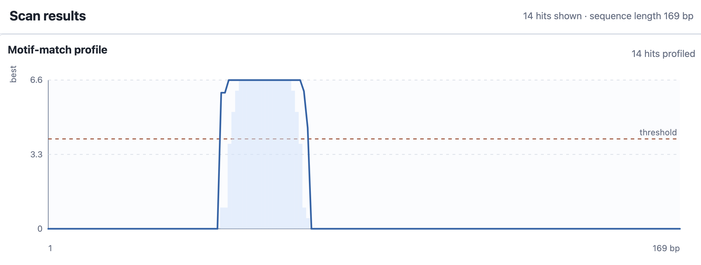
Supplementary Fig. 1 TP53 HG38 chr1:883055-883223 binding plot. <br>

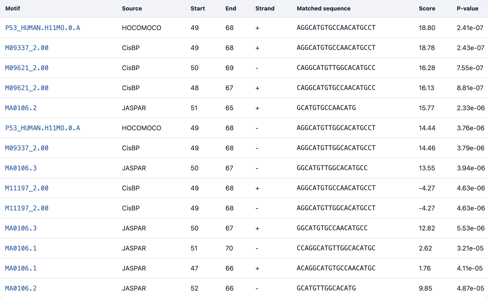
Supplementary Table 1 TP53 HG38 chr1:883055-883223 binding score table. <br>


### In order to emulate this process follow these steps:

save a file named rs573372954.fasta with the following contents:
```
>rs573372954_REF
GAGCACAGAGTGCACTCAAGGTGACGTGCTTGGGGACACACAGTGGGATGG
>rs573372954_ALT
GAGCACAGAGTGCACTCAAGGTGACATGCTTGGGGACACACAGTGGGATGG
```

create a file named AHR_Human.fasta with the following contents:
```
>sp|P35869|AHR_HUMAN Aryl hydrocarbon receptor OS=Homo sapiens OX=9606 GN=AHR PE=1 SV=2
MNSSSANITYASRKRRKPVQKTVKPIPAEGIKSNPSKRHRDRLNTELDRLASLLPFPQDV
INKLDKLSVLRLSVSYLRAKSFFDVALKSSPTERNGGQDNCRAANFREGLNLQEGEFLLQ
ALNGFVLVVTTDALVFYASSTIQDYLGFQQSDVIHQSVYELIHTEDRAEFQRQLHWALNP
SQCTESGQGIEEATGLPQTVVCYNPDQIPPENSPLMERCFICRLRCLLDNSSGFLAMNFQ
GKLKYLHGQKKKGKDGSILPPQLALFAIATPLQPPSILEIRTKNFIFRTKHKLDFTPIGC
DAKGRIVLGYTEAELCTRGSGYQFIHAADMLYCAESHIRMIKTGESGMIVFRLLTKNNRW
TWVQSNARLLYKNGRPDYIIVTQRPLTDEEGTEHLRKRNTKLPFMFTTGEAVLYEATNPF
PAIMDPLPLRTKNGTSGKDSATTSTLSKDSLNPSSLLAAMMQQDESIYLYPASSTSSTAP
FENNFFNESMNECRNWQDNTAPMGNDTILKHEQIDQPQDVNSFAGGHPGLFQDSKNSDLY
SIMKNLGIDFEDIRHMQNEKFFRNDFSGEVDFRDIDLTDEILTYVQDSLSKSPFIPSDYQ
QQQSLALNSSCMVQEHLHLEQQQQHHQKQVVVEPQQQLCQKMKHMQVNGMFENWNSNQFV
PFNCPQQDPQQYNVFTDLHGISQEFPYKSEMDSMPYTQNFISCNQPVLPQHSKCTELDYP
MGSFEPSPYPTTSSLEDFVTCLQLPENQKHGLNPQSAIITPQTCYAGAVSMYQCQPEPQH
THVGQMQYNPVLPGQQAFLNKFQNGVLNETYPAELNNINNTQTTTHLQPLHHPSEARPFP
DLTSSGFL
```

model the AHR binding of dna:
```bash
modcrelib model -v -d ./dummy -i AHR_Human.fasta -o ./models --pdb={path to the pdb folder installed by modcrelib} --best --renumerate  --n-temp=1 --n-total=1 --n-model=1
```
Process the models:
```bash
modcrelib renumber models remodels
```

Prep profiling:
```bash
mkdir profiling
cp remodels/*pdb profiling/
mv rs573372954.fasta profiling/
```
Create a file profiling/ASBprofilerinput.txt with the name of the folder as content (profiling)

Run Profiling:
```bash
modcrelib profile --dummy ./dummy -i profiling/ASBprofilerinput.txt  -d profiling/rs573372954.fasta  --pbm={path to the pbm folder installed by modcrelib} --pdb={path to the pdb folder installed by modcrelib} -v --auto --known --refine 2 --plot --html > profiling/profiler.log 2>&1
```

Plot Comparison:
In the output folder of the profile command there will be a {input file name (ASBprofilerinput.txt) }profiling{aa range of model (numbers)} folder that contains several csv files. These csv file contain the statistical potentials calculated as well as error info. The folder will also contain plotted comparisons already prepared by modcrelib. To generate a custom plot as we have for figure 1 you would need to execute the following python script (with csv file location placeholders replaced with your actual files):

```python
import pandas as pd
import numpy as np
import matplotlib.pyplot as plt

def compare_profiles(hasbind_mean, hasbind_rmsd,
                     lostbind_mean, lostbind_rmsd,
                     column="normal_s3dc_dd",
                     output="Comparison"):
    
    # Load CSVs
    hb_mean = pd.read_csv(hasbind_mean)
    hb_rmsd = pd.read_csv(hasbind_rmsd)
    lb_mean = pd.read_csv(lostbind_mean)
    lb_rmsd = pd.read_csv(lostbind_rmsd)

    # Basic checks
    for df, name in [(hb_mean, "HasBind mean"), (lb_mean, "LostBind mean")]:
        if "Position" not in df.columns:
            raise ValueError(f"'Position' missing in {name} CSV.")
        if column not in df.columns:
            raise ValueError(f"'{column}' missing in {name} CSV.")

    for df, name in [(hb_rmsd, "HasBind rmsd"), (lb_rmsd, "LostBind rmsd")]:
        if column not in df.columns:
            raise ValueError(f"'{column}' missing in {name} CSV.")

    # Extract data
    x = hb_mean["Position"].values
    hb_y = hb_mean[column].values
    hb_e = hb_rmsd[column].values
    lb_y = lb_mean[column].values
    lb_e = lb_rmsd[column].values


    # Colorblind-friendly colors (blue and orange)
    wildtype_color = "#0072B2"  # Blue  
    mutant_color = "#D55E00"    # Orange

    # Plot
    plt.figure(figsize=(9,6))

    # HasBind curve (Wildtype)
    plt.plot(x, hb_y, '-', lw=2, label="Wildtype", alpha=0.85, color=wildtype_color)
    plt.fill_between(x, hb_y - hb_e, hb_y + hb_e, alpha=0.20, color=wildtype_color)

    # LostBind curve (Mutant)
    plt.plot(x, lb_y, '--', lw=2, label="Mutant", alpha=0.85, color=mutant_color)
    plt.fill_between(x, lb_y - lb_e, lb_y + lb_e, alpha=0.20, color=mutant_color)

    # Mark SNP position (position 26)
    plt.axvline(x=26, color='gray', linestyle='--', lw=2, alpha=0.7, label='SNP position')
    plt.text(26, plt.ylim()[1], 'SNP', color='gray', ha='center', va='bottom', fontsize=12)


    plt.xlabel("Position")
    plt.ylabel("Binding score")
    #plt.title(f"Comparison of {column} at ASB site for TF AHR")
    plt.legend()
    plt.tight_layout()

    outfile = f"{output}_{column}.png"
    plt.savefig(outfile, dpi=300)
    plt.close()

    print(f"Saved comparison plot: {outfile}")


compare_profiles(
    "/Location/of/First_1.mean.csv",
    "/Location/of/First_1.rmsd.csv",
    "/Location/of/Second_1.mean.csv",
    "/Location/of/Second_1.rmsd.csv",
    column="normal_s3dc_dd",
    output="ASBExample_Comparison"
)
```


# Statistical Potential Methodology

On the calculation of scores:
The split-statistical potential framework evaluates the binding affinity between a Transcription Factor (TF) and a DNA sequence by analyzing the structural compatibility of their interface. Instead of relying on single-nucleotide interactions, the method uses a dinucleotide-based approach (two consecutive bases) to account for structural context and address the additivity problem in protein-DNA recognition.
The framework classifies the structural interface into a discrete set of residue and nucleotide environments. For the amino acid environment this can be a combination of 20 of the standard amino acids being found in any of the 6 environmental categories ( helix, coil, strand, buried, or exposed). For the nucleotide environment we consider 16 dinucleotides (i.e., 42 different combinations of two nucleotides) and 8 environments: 2 for the closest strand (forward or reverse), 2 for the closest DNA groove (major or minor), and 2 for the closest chemical group of the dinucleotide (nucleobase or deoxyribose phosphate). These definitions produce a total of 128 dinucleotide–environment combinations. Statistical potentials then derive pseudo-energy scores based on how frequently specific residue-environment pairs contact each other in known structures compared to a random distribution. When scoring different DNA sequences for a fixed TF, the local sequence-dependent folding energies Elocal are omitted from the calculation. DNA local terms are ignored because any accessible nucleotide sequence can theoretically be bound, making baseline DNA environment preferences irrelevant. Protein local terms are ignored because the TF structure remains constant during the sequence-discriminating process. By eliminating these background variables, the system isolates the ES3DC potential. This specialized potential focuses strictly on the direct, spatial compatibility of the amino acid and dinucleotide environments. The resulting scores are transformed into Z-scores to rank and predict the optimal, high-affinity DNA binding sites for the transcription factor.

# Supplementary Section 2

Use of PWM Aggregation on a multi Domain protein.<br>
We tested the ability for ModCRElibs PWM prediction and aggregation functionality to recover the different DNA binding domain binding patterns for a known multi domain TF. For this task we selected PAX6. This TF contains a paired domain (PD) and a paired-type of homeodomain (HD). These domains can bind DNA working cooperatively or independently of each other.  The DNA binding consensus for HD is TAAT while the reverse complement of the PD consensus sequence is RNKMANTSAWGCGTGAANNT. We first used ModCRElib to model structures of the PAX6 binding to DNA. The method followed what was previously outlined in supplementary methods section 1 with the addition of multiple models being generated per amino acid sequence (optional parameters: --best --renumerate  --n-temp=1 --n-total=1 --n-model=10).  We then predict PWMs for each structure with ‘modcrelib pwm’ (optional parameters: --refine 2  --dummy=./dummy --auto --known). Additionally, nearest neighbor PWMs were included in the clustering folder with the command ‘modcrelib get_json’. The test PWMs were removed manually from the resulting json file.  The PWM aggregation function ‘modcrelib aggregate’ (optional parameters: --complete 0.95 --pvalue=0.005 --threshold=0.020 -l 50 --verbose --reference 0.99 --trim) was then applied to generate clusters of PWMs, which were in turn compared to a database of PAX6 motifs retrieved from CIS-BP as well as the PD consensus sequence. The two highest scoring results were obtained for clusters 3 and 4. Which matched well with the PD consensus sequence and a fragment containing the HD binding sequence (Fig. 3).Full tomtom aggregation score results are shown in Supplementary Figure X. 

### In order to emulate this process follow these steps:

Create a file named PAX_Human.fasta with the following contents:

```
>sp|P26367|PAX6_HUMAN Paired box protein Pax-6 OS=Homo sapiens OX=9606 GN=PAX6 PE=1 SV=2
MQNSHSGVNQLGGVFVNGRPLPDSTRQKIVELAHSGARPCDISRILQVSNGCVSKILGRY
YETGSIRPRAIGGSKPRVATPEVVSKIAQYKRECPSIFAWEIRDRLLSEGVCTNDNIPSV
SSINRVLRNLASEKQQMGADGMYDKLRMLNGQTGSWGTRPGWYPGTSVPGQPTQDGCQQQ
EGGGENTNSISSNGEDSDEAQMRLQLKRKLQRNRTSFTQEQIEALEKEFERTHYPDVFAR
ERLAAKIDLPEARIQVWFSNRRAKWRREEKLRNQRRQASNTPSHIPISSSFSTSVYQPIP
QPTTPVSSFTSGSMLGRTDTALTNTYSALPPMPSFTMANNLPMQPPVPSQTSSYSCMLPT
SPSVNGRSYDTYTPPHMQTHMNSQPMGTSGTTSTGLISPGVSVPVQVPGSEPDMSQYWPR
LQ
```

Model multiple TF-DNA interactions
```bash
modcrelib model -v -d ./dummy -i PAX_Human.fasta -o ./AGmodels --pdb={path to the pdb folder installed by modcrelib} --best --renumerate  --n-temp=1 --n-total=1 --n-model={Desired number of models}
```
Process the models:
```bash
modcrelib renumber AGmodels AGremodels
```

Generate PWMs for models:
```bash
modcrelib pwm -i AGremodels -o AGpwm --pdb={path to the pdb folder installed by modcrelib} --pbm={path to the pbm folder installed by modcrelib}  --refine 2  --dummy=./dummy --auto --known
```

Aggregate PWMs for models:
```bash
modcrelib get_json ./ MultiDomain.fa TF_codes.txt files/TF_accession_family.csv files/TF_nearest_neighbor_30-100.csv AGpwm AGJSON uniprot

modcrelib aggregate --complete 0.95 -i AGJSON --pvalue=0.005 --threshold=0.020 -l 50 --jaspar=./ExternalPWMs/jaspar_pwms --cisbp=./ExternalPWMs/CisBP_pwms --hocomoco=./ExternalPWMs/hocomoco_pwms --modcre=AGpwm  -o AGAggregates/JSON_MAGG_PV0.005_T0.020_L50_reference --verbose --info=AGAggregates/info_JSON_MAGG_PV0.005_T0.020_L50.log --reference 0.99 --trim --dummy=AGAggregates/dummy_JSON_PV0.005_T0.020_L50

cd AGAggregates/JSON_MAGG_PV0.005_T0.020_L50_reference/P26367/
```
save the following as PAX6_database.meme:
```
MEME version 4

ALPHABET= ACGT

strands: + -

Background letter frequencies:
A 0.25 C 0.25 G 0.25 T 0.25

MOTIF M00390_2.00

letter-probability matrix: alength= 4 w= 10
0.243261 0.166357 0.201167 0.389216
0.150809 0.096160 0.097127 0.655904
0.132509 0.071283 0.033671 0.762537
0.375039 0.047800 0.050251 0.526910
0.786702 0.022598 0.070658 0.120043
0.049934 0.380205 0.076762 0.493099
0.144111 0.083145 0.473703 0.299041
0.480914 0.085258 0.283068 0.150760
0.111427 0.385049 0.255538 0.247986
0.205443 0.332012 0.201375 0.261170
MEME version 4

ALPHABET= ACGT

strands: + -

Background letter frequencies:
A 0.25 C 0.25 G 0.25 T 0.25

MOTIF M00391_2.00

letter-probability matrix: alength= 4 w= 9
0.201377 0.189650 0.199373 0.409599
0.157052 0.155489 0.139293 0.548166
0.419702 0.117866 0.128965 0.333467
0.566608 0.127698 0.131587 0.174107
0.096197 0.207764 0.119869 0.576170
0.155086 0.164676 0.331617 0.348620
0.337231 0.142703 0.347501 0.172564
0.172316 0.364793 0.230288 0.232602
0.256317 0.288996 0.225070 0.229617
MEME version 4

ALPHABET= ACGT

strands: + -

Background letter frequencies:
A 0.25 C 0.25 G 0.25 T 0.25

MOTIF M00392_2.00

letter-probability matrix: alength= 4 w= 8
0.143010 0.107347 0.036020 0.713623
0.000250 0.025225 0.000250 0.974276
0.974276 0.000250 0.000250 0.025225
0.999251 0.000250 0.000250 0.000250
0.000250 0.000250 0.000250 0.999251
0.000250 0.000250 0.125125 0.874376
0.804939 0.000277 0.194506 0.000277
0.038786 0.576421 0.153994 0.230799
MEME version 4

ALPHABET= ACGT

strands: + -

Background letter frequencies:
A 0.25 C 0.25 G 0.25 T 0.25

MOTIF M00393_2.00

letter-probability matrix: alength= 4 w= 8
0.235698 0.265748 0.314993 0.183561
0.194613 0.361771 0.230676 0.212940
0.142042 0.092400 0.025949 0.739610
0.699379 0.079059 0.175949 0.045613
0.870945 0.043362 0.006683 0.079010
0.058490 0.192260 0.064641 0.684609
0.137513 0.209290 0.328232 0.324966
0.380775 0.133247 0.314885 0.171093
MEME version 4

ALPHABET= ACGT

strands: + -

Background letter frequencies:
A 0.25 C 0.25 G 0.25 T 0.25

MOTIF M00394_2.00

letter-probability matrix: alength= 4 w= 9
0.268595 0.158096 0.207100 0.366209
0.161909 0.084524 0.116400 0.637168
0.146018 0.111467 0.047643 0.694873
0.237832 0.138596 0.104749 0.518823
0.616295 0.130807 0.148967 0.103931
0.105546 0.326735 0.099400 0.468319
0.240622 0.117123 0.348357 0.293897
0.394030 0.124764 0.319395 0.161811
0.168107 0.248291 0.374129 0.209474
MEME version 4

ALPHABET= ACGT

strands: + -

Background letter frequencies:
A 0.25 C 0.25 G 0.25 T 0.25

MOTIF M00395_2.00

letter-probability matrix: alength= 4 w= 9
0.219460 0.327396 0.179679 0.273464
0.088570 0.053186 0.000936 0.857308
0.857068 0.032574 0.099835 0.010523
0.954621 0.009692 0.000478 0.035209
0.041206 0.128843 0.065930 0.764020
0.111328 0.194900 0.327826 0.365946
0.451704 0.092114 0.302786 0.153397
0.201062 0.302963 0.282481 0.213494
0.202149 0.292657 0.221186 0.284008
MEME version 4

ALPHABET= ACGT

strands: + -

Background letter frequencies:
A 0.25 C 0.25 G 0.25 T 0.25

MOTIF M00396_2.00

letter-probability matrix: alength= 4 w= 8
0.243137 0.255603 0.173058 0.328201
0.180751 0.050761 0.028138 0.740350
0.754094 0.029830 0.091425 0.124651
0.948503 0.020184 0.016361 0.014953
0.061921 0.014525 0.234126 0.689428
0.144617 0.648127 0.069692 0.137564
0.112198 0.502838 0.114465 0.270499
0.173843 0.301314 0.278148 0.246695
MEME version 4

ALPHABET= ACGT

strands: + -

Background letter frequencies:
A 0.25 C 0.25 G 0.25 T 0.25

MOTIF M00397_2.00

letter-probability matrix: alength= 4 w= 14
0.222869 0.222869 0.222869 0.331393
0.301150 0.196775 0.305300 0.196775
0.173218 0.173218 0.173218 0.480345
0.290347 0.101116 0.507421 0.101116
0.147808 0.755127 0.048533 0.048533
0.226946 0.118673 0.128567 0.525813
0.692134 0.307374 0.000246 0.000246
0.999261 0.000246 0.000246 0.000246
0.027377 0.027377 0.027377 0.917868
0.053471 0.053471 0.053471 0.839587
0.768916 0.077028 0.077028 0.077028
0.342275 0.149130 0.260189 0.248406
0.201714 0.201714 0.201714 0.394859
0.226053 0.226053 0.321841 0.226053
MEME version 4

ALPHABET= ACGT

strands: + -

Background letter frequencies:
A 0.25 C 0.25 G 0.25 T 0.25

MOTIF M00398_2.00

letter-probability matrix: alength= 4 w= 9
0.200803 0.302573 0.191010 0.305614
0.177817 0.085691 0.029688 0.706804
0.715401 0.087605 0.110260 0.086734
0.840802 0.036758 0.032929 0.089511
0.121787 0.065514 0.104823 0.707876
0.181849 0.125609 0.315190 0.377351
0.418678 0.099197 0.332654 0.149471
0.227606 0.295189 0.267098 0.210107
0.191129 0.318285 0.222060 0.268526
MEME version 4

ALPHABET= ACGT

strands: + -

Background letter frequencies:
A 0.25 C 0.25 G 0.25 T 0.25

MOTIF M00399_2.00

letter-probability matrix: alength= 4 w= 8
0.145807 0.166050 0.102749 0.585395
0.047416 0.026548 0.887984 0.038052
0.795904 0.000436 0.143952 0.059709
0.041428 0.910466 0.001396 0.046710
0.672067 0.019113 0.247239 0.061581
0.160336 0.171961 0.418748 0.248954
0.200186 0.289816 0.301643 0.208355
0.204146 0.262129 0.190345 0.343380
MEME version 4

ALPHABET= ACGT

strands: + -

Background letter frequencies:
A 0.25 C 0.25 G 0.25 T 0.25

MOTIF PDPAX6_consensus
letter-probability matrix: alength= 4 w= 20 nsites= 1 E= 0
1.00 0.00 0.00 0.00
0.25 0.25 0.25 0.25
0.25 0.25 0.25 0.25
0.00 0.00 0.00 1.00
0.00 0.00 0.00 1.00
0.00 1.00 0.00 0.00
1.00 0.00 0.00 0.00
0.00 1.00 0.00 0.00
0.00 0.00 1.00 0.00
0.00 1.00 0.00 0.00
0.50 0.00 0.00 0.50
0.00 0.00 0.00 1.00
0.00 0.50 0.50 0.00
1.00 0.00 0.00 0.00
0.25 0.25 0.25 0.25
0.00 0.00 0.00 1.00
0.00 0.00 0.50 0.50
0.50 0.50 0.00 0.00
0.25 0.25 0.25 0.25
0.00 0.50 0.00 0.50
```


```bash
cat cluster_*/*average*.meme >> Temp.meme

tomtom -no-ssc -oc PAX6tomtom -verbosity 1 -min-overlap 5 -dist pearson -evalue -thresh 10.0 Temp.meme PAX6_database.meme
```

#### TomTom comparison results from a aggregate of 10 PAX6 models. 

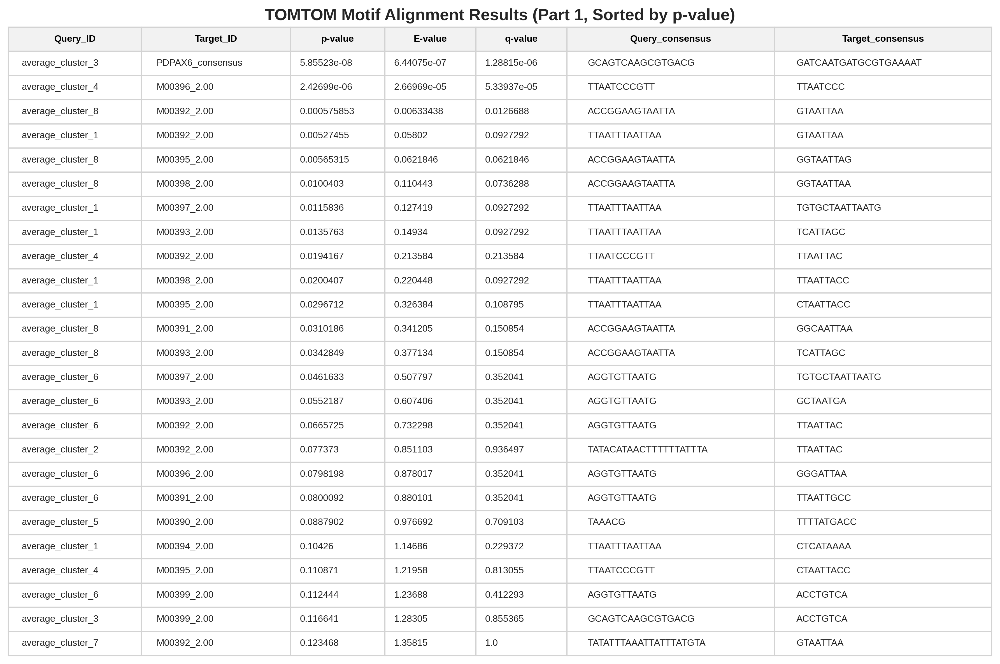
Supplementary Table 2: TomTom comparison part 1<br>
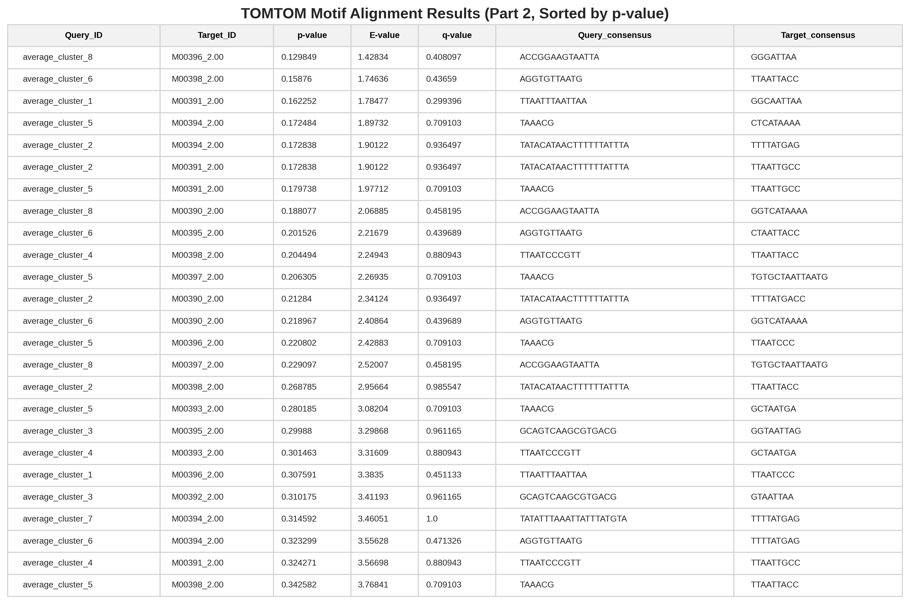
Supplementary Table 3: TomTom comparison part 2<br>
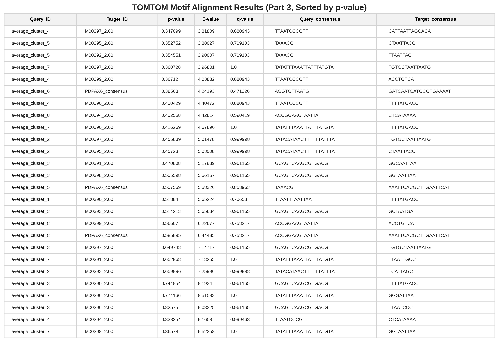
Supplementary Table 4: TomTom comparison part 3<br>


### Logos of cluster averages for an aggregation with 20 PAX6 models.

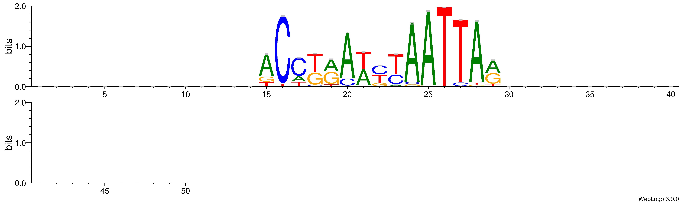
Supplementary Fig. 2 : Cluster 1<br>
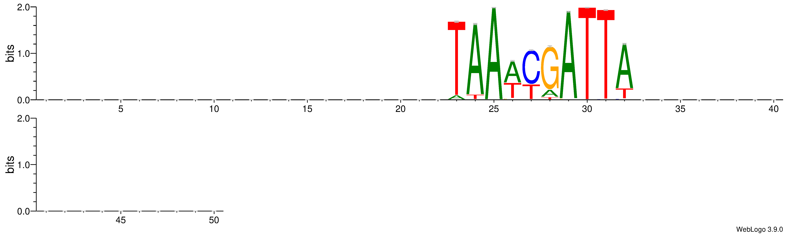
Supplementary Fig. 3 : Cluster 2<br>
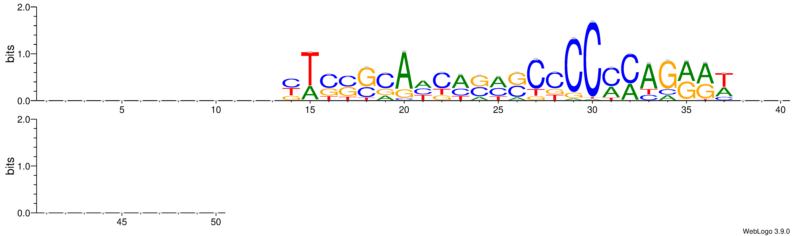
Supplementary Fig. 4 : Cluster 3<br>
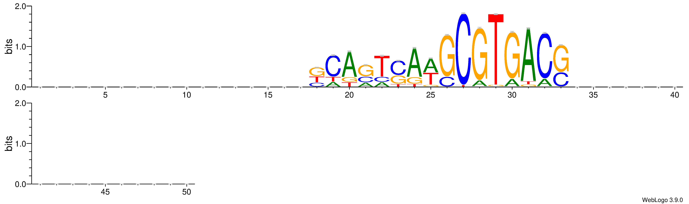
Supplementary Fig. 5 : Cluster 4<br>
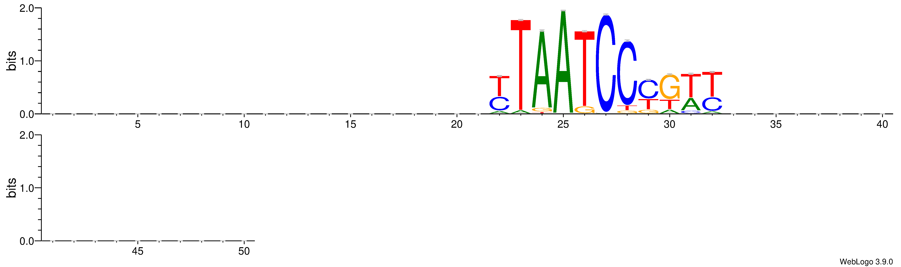
Supplementary Fig. 6 : Cluster 5<br>
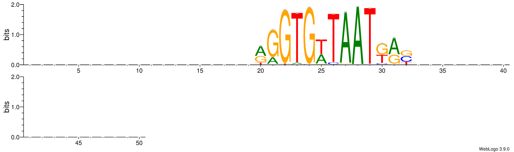
Supplementary Fig. 7 : Cluster 6<br>

# Supplementary Section 3

Prediction of PBM E-scores.<br>
The existing ModCRE server is capable of generating scoring profiles for input TFs along a desired DNA sequence. However, due to server limitations the implementation of this functionality remains restricted to single or double sequence submissions. To address this issue ModCRElib enables high throughput applications by virtue of avoiding server queuing as well as enabling job parallelization. To demonstrate this we replicated a Protein Binding Experiment with ModCRElib for the bHLH TF MAX. First, all possible 8-mer DNA sequences were generated. Next, a model ( PWM and "thread" file) for the MAX homodimer amino acid sequence were generated. The initial structural model and pwm prediction were generated as mentioned in supplementary sections 1 and 2. The thread file was generated with ‘modcrelib thread’ command (optional parameters: --standard --delta 1 --verbose --auto --known).  Because the binding site was calculated by ModCRElib to be 14 nucleotides we added a head and tail of poli-A (with 3 As) to each of the 8-mers to be tested. The template threading file was then copied and modified for each of the 32768 unique binding sequences. This means that each unique 8mer we generated a thread file with its unique poli-A tail and head inclusive dna sequence in the files “dna” and “dna_fixed” fields.   ModCRElib scoring was run with 50 jobs executing in parallel and finished within 12 hours in our cluster. Scoring was run as described in supplementary section 1 and the cluster set up was accomplished by supplying the relevant information to the “modcrelib setup” command. To compare the results to known PBM data, we retrieved MAX E-score values from CISBP (30). The comparison of ModCRElib normalized statistical potential scoring-energy (i.e. ES3DC, as defined by Fornes et al. (11) and the “On the calculation of scores” supplementary section) with PBM E-scores can be seen in (Fig. 4). For cases of significant binding at E > 0.4 as previously defined (31) we see strong correlation between E-scores and statistical potential scores. When generating a ROC curve with True Positives defined by the same threshold, ModCRElib produces an AUC of 0.912 further showing its predictive value for PBM experiments (Fig. 5). 

### In order to emulate this process follow these steps:

The following python script will generate the octomers with flanking A summing to 14 bases. 
 ```python 
 #!/usr/bin/env python3
import itertools

def get_reverse_complement(seq):
    """Calculates the reverse complement of a DNA string."""
    trans_table = str.maketrans("ATCG", "TAGC")
    return seq.translate(trans_table)[::-1]

def generate_tf_octamers(output_file="unique_dna_sequences.txt"):
    bases = ['A', 'C', 'G', 'T']
    octamer_length = 8
    prefix = "AAA"
    suffix = "AAA"
    
    # Track unique octamer cores
    seen_cores = set()
    
    print("Generating unique TF-recognition sequences...")
    
    count = 0
    with open(output_file, "w") as f:
        for p in itertools.product(bases, repeat=octamer_length):
            octamer_core = "".join(p)
            
            # 1. Compute the reverse complement of just the 8-base core
            rev_comp_core = get_reverse_complement(octamer_core)
            
            # 2. Pick the canonical core (alphabetically smaller)
            canonical_core = min(octamer_core, rev_comp_core)
            
            # 3. If we haven't seen this core interaction yet, wrap it and save it
            if canonical_core not in seen_cores:
                seen_cores.add(canonical_core)
                
                # Attach the flanks to the chosen canonical orientation
                full_sequence = f"{prefix}{canonical_core}{suffix}\n"
                f.write(full_sequence)
                count += 1
                
    print(f"✓ Success! {count:,} biologically unique sequences written to '{output_file}'.")

if __name__ == "__main__":
    generate_tf_octamers()

```

Follow the method of model and pmw generation outlined in example 1 and 2 for the following TF:

```
>sp|P61244|MAX_HUMAN Protein max OS=Homo sapiens OX=9606 GN=MAX PE=1 SV=1
MSDNDDIEVESDEEQPRFQSAADKRAHHNALERKRRDHIKDSFHSLRDSVPSLQGEKASR
AQILDKATEYIQYMRRKNHTHQQDIDDLKRQNALLEQQVRALEKARSSAQLQTNYPSSDN
SLYTNAKGSTISAFDGGSDSSSESEPEEPQSRKKLRMEAS
```

Create a placeholder DNA sequence to use for generating the thread file (Ref1.fa) with the contents:
```
>Ref1
gagctgcccaccccgctacagcagctggctgtgcaaggtggctggaccaca
```

Generate a thread file:
```bash
modcrelib thread --standard --dummy ./dummy -i {processed_MAX_model} -o threads --pdb={path to the pdb folder installed by modcrelib} --pbm={path to the pbm folder installed by modcrelib} --seq Ref1.fa --dna agctggc --delta 1 --pwm {meme file for MAX predicted by modcrelib} --verbose --auto --known
```

The following python script will generate unique threader files for each of the sequences to be scored for MAX (you will have to edit the input file names at the bottom of the script first)

```python
#!/usr/bin/env python3
import os
import re
from pathlib import Path

def parse_threader_template(template_path):
    """Parses the template threader file to extract the base filename parts and text content."""
    # Changed 'text' to 'r' for standard text-reading mode
    with open(template_path, 'r', encoding='utf-8', errors='ignore') as f:
        content = f.read()

    # Extract PDB name using regex
    pdb_name_match = re.search(r'^#\s*PDB\s*name\s*:\s*(.+)$', content, re.MULTILINE)
    # Extract PDB chain using regex 
    pdb_chain_match = re.search(r'^#\s*PDB\s*chain\s*:\s*(.+)$', content, re.MULTILINE)

    if not pdb_name_match or not pdb_chain_match:
        raise ValueError("Could not find '# PDB name' or '# PDB chain' lines in the template file.")

    pdb_name = pdb_name_match.group(1).strip()
    pdb_chain = pdb_chain_match.group(1).strip()

    return content, pdb_name, pdb_chain


def generate_threader_files(sequences_file, template_file, output_dir="output_threads"):
    """Generates modified threader files for each DNA sequence."""
    # Ensure the output directory exists to prevent file creation errors
    output_path = Path(output_dir)
    output_path.mkdir(parents=True, exist_ok=True)

    # 1. Read the template metadata and body text
    print(f"Reading template: {template_file}...")
    try:
        template_content, pdb_name, pdb_chain = parse_threader_template(template_file)
    except Exception as e:
        print(f"Error parsing template file: {e}")
        return

    # 2. Open the unique sequences file and loop through lines
    seq_path = Path(sequences_file)
    if not seq_path.exists():
        print(f"Error: Sequence file '{sequences_file}' not found.")
        return

    print("Generating unique template variants...")
    
    # Pre-compile regex patterns for replacement to maximize iteration speed
    # This matches the block starting with >dna, down to the next // line
    dna_pattern = re.compile(r'(>dna\n)[^;\n]+(;0\n//)')
    fixed_pattern = re.compile(r'(>dna_fixed\n)[^;\n]+(;0\n//)')

    count = 0
    with open(seq_path, 'r', encoding='utf-8') as sf:
        for line in sf:
            sequence = line.strip()
            if not sequence:
                continue

            # Construct the dynamic file name based on your naming convention
            # Form: PDBNAME_CHAIN_SEQUENCE.txt
            file_name = f"{pdb_name}_{pdb_chain}_{sequence}.txt"
            target_file_path = output_path / file_name

            # Build the replacement string using a lambda backreference
            # \1 references the header (e.g. '>dna\n') and \2 references the trailer (e.g. ';0\n//')
            modified_content = dna_pattern.sub(rf'\1{sequence}\2', template_content)
            modified_content = fixed_pattern.sub(rf'\1{sequence}\2', modified_content)

            # Write out the customized threader file
            with open(target_file_path, 'w', encoding='utf-8') as out_f:
                out_f.write(modified_content)
            
            count += 1
            if count % 5000 == 0:
                print(f"  Processed {count:,} files...")

    print(f"✓ Success! Generated {count:,} threader files inside the '{output_dir}/' directory.")

if __name__ == "__main__":
    # Update these filenames
    SEQUENCES_FILE = "unique_dna_sequences.txt"
    TEMPLATE_FILE = "template_threader.txt" 
    
    generate_threader_files(SEQUENCES_FILE, TEMPLATE_FILE)

```

Now Run the scoring for each of these threader files set up with you local cluster parameters (submitted to modcrelib setup). 

